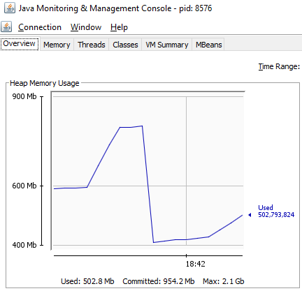
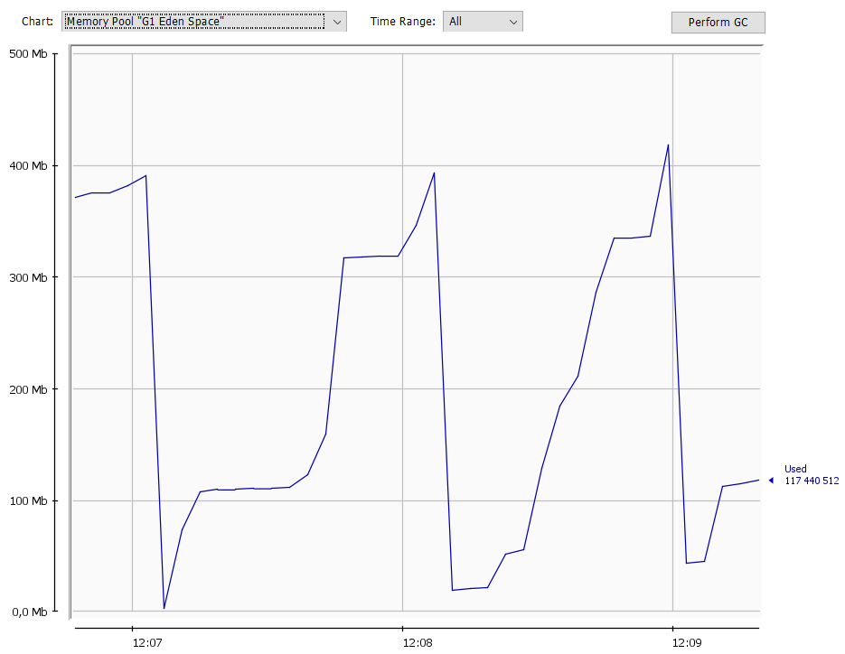

#Results MyListTest

##createALotOfObjects

При создании множества объектов (1000000), места в Eden уже нет, JVM проводит garbage collection, 
что значит, что JVM ищет в памяти все объекты, которые более не нужны, и избавляется от них.

````
...
MyList num is 787252 finalize started
MyList num is 787252 finalize finished
MyList num is 787251 finalize started
MyList num is 787251 finalize finished
MyList num is 787250 finalize started
MyList num is 787250 finalize finished
MyList num is 787249 finalize started
...
````



Объекты, котороые нужны отмечаются для сохранения и копируются в Survivor, а Eden очищается.
После этого новые объекты могу быть созданы.
````
...
MyList num is 840265 finalize started
MyList num is 840265 finalize finished
Added object 987822
Added object 987823
Added object 987824
Added object 987825
MyList num is 840264 finalize started
MyList num is 840264 finalize finished
...
````

##makeAvailableAgainTest

Так как объект становится недоступным, он помечается f-достижимым, неанализированым.
GC определяет, что объект находится в незавершенном состоянии, поэтому gc добавляет объект в
F-очередь и изменяет состояние на f-достижимое завершение, выполняет finalize().
Состояние становится достижимым и завершается. В это время на него ссылается другой объект, по этому
он не станет недоступным для завершения и уничтожения.

````
Added object 200 to MyList
Calling GC
MyListRevived in finalize()
MyList num is 200 finalize started
MyList num is 200 finalize finished
Restoring MyListRevived
MyListRevived is restored.
Trying to acccess after GC
Revived object num is 200
````

##referenceOneToAnotherAndBack

Так как при ссылании объектов друг на друга, мы не можем получить к ним доступ из-вне, то они
удаляются, так как считаются недоступными.

