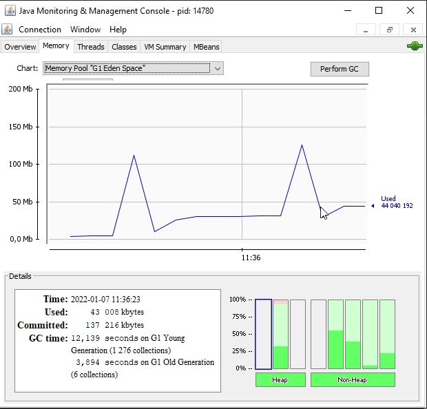

1) При создании большого кол-ва объектов они удаляются в относительно произвольном порядке:

Ниже аутпут теста void manyObjectsTest():

_CountedObj 32831 is being finalized.
CountedObj 29587 is being finalized.
CountedObj 31675 is being finalized.
CountedObj 33579 is being finalized.
CountedObj 35220 is being finalized.
CountedObj 29109 is being finalized.
CountedObj 29827 is being finalized.
CountedObj 30570 is being finalized.
CountedObj 31261 is being finalized.
CountedObj 30112 is being finalized.
During the course of creating 10M objects, 2174045 were finalized._

из анализа jconsole видим резкие скачки памяти при вызове теста, который потом полностью очищается.

2) Тест makeReachableTest проверяет попадет ли объект в gc повторно если сделать его
достижимым в ходе действия finalize() - cогласно аутпуту ответ - нет (вызывается только один раз).

_Reachable CountedObj 0 is being finalized._

3) Тест сrossReferenceTest проверяет будет ли очищен объект на который ссылается объект, который
сделался недостижимымм - согласно аутпуту ответ - да (для обоих объектов срабатывает finalize.)

_CountedObj 0 is being finalized.
CountedObj 1 is being finalized._

